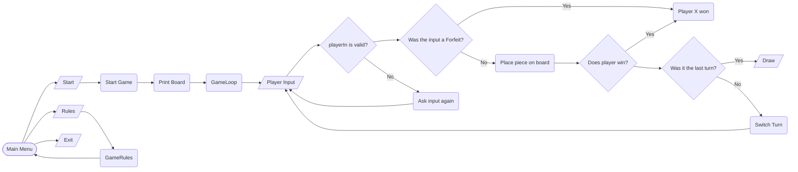

#  Galo da Velha
Este projeto foi criado como solução do projeto 1 de Linguagens de Programação 2023/2024.

Um jogo para dois jogadores feito em C# 8.0. O projeto consiste de um tabuleiro com 16 espaços (4x4), existindo 16 peças diferentes que podem ser construídas combinando as quatro características seguintes:
 - Tamanho (grande/pequeno)
 - Cor (clara/escura)
 - Forma (círculo/quadraado)
 - Furo (com/sem)

 
*Tabuleiro de jogo*
## Objetivo
O objetivo do jogo é completar uma linha com quatro peças que sejam semelhantes em pelo menos umas das suas quatro características (tamanho, cor, forma ou furo). A linha pode ser vertical, horizontal ou diagonal. O vencedor é o jogador que colocar a quarta da linha. O jogo termina em empate quando nenhum atinge o objetivoapós colocação das 16 peças.

## Regras do Jogo
Os jogadores jogam alternadamente, colocando uma peça no tabuleiro. Uma vez colocadas as peças não podem voltar a ser movidas.
A escolha da peça a colocar no tabuleiro não é feita pelo mesmo jogador que a coloca; é o adversário que decide qual será a peça seguinte a colocar:
1. Adversário escolhe peça a ser colocada pelo jogador atual.
2. Jogador atual coloca no tabuleiro a peça dada pelo adversário.

Se a peça colocada pelo jogador atual fizer uma linha de quatro peças com pelo menos uma característica semelhante (tamanho, cor, forma ou furo), esse jogador vence.

# Autoria

- André Sebastião a22008519
- António Sotto-Mayor a22007432
- Diogo Freire a22104684

## Distribuição de Tarefas
André Sebastião
 - Criação do documento README.md.
 - Implementação e integração dos diferentes elementos e fluxogramas no documento README.md.
 - Criação dos textos e repostas dadas ao jogador durante o jogo.
 - Documentação de diferentes partes do código.
 
António Sotto-Mayor
- Lógica dos fluxogramas.
- Criação das várias peças do jogo.
- Criação do tabuleiro de jogo.
- Implementação das regras
- Resolução de bugs.

Diogo Freire
- Implementação das peças coloridas.
- Menu inicial.
- Implementação das regras.
- Resolução de bugs.

# Arquitetura da solução
O código foi dividio em métodos para facilitar a legibilidade e evitar multiplas repetições das mesmas funções.
Para guardar a informação das peças e os seus valores Unicode, foi usado um enumerador.
Foram usados vários for's para percorrer arrays onde se encontravam as condições de vitória, tal como para verificar as peças em casa linha/coluna que depois seguiram para um segundo array, que foi usado para a verificação das tais condições.
Foi usado Console.Foreground color e Console.ResetColor() para diferenciar as peças do jogador 1 tal como as peças do jogador 2.
Foi usado Switch Cases para verificar as condições de vitoria e para definir que tipo de vitória foi (desistência, vitória normal, empate).

## Fluxograma

# Referências
- [1] Whitaker, R.B. (2022). **The C# Player's Guide** (5th Edition). Starbound.
- [2] Albahari, J., & Johannsen, E. (2020). **C# 8.0 in a Nutshell**. O'Reilly Media.
- [3] Dorsey, T. (2017). **Doing Visual Studio and .NET Code Documentation Right**. Visual Studio Magazine. Retrieved from https://visualstudiomagazine.com/articles/2017/02/21/vs-dotnet-code-documentation-tools-roundup.aspx
- [4] Nathan Bloomfield (2007). **Text to ASCII Generator**. Main Menu Text Font http://patorjk.com/software/taag/
- [5] Learn.Microsoft dotnet. **Console Class**. https://learn.microsoft.com/en-us/dotnet/api/system.console?view=netstandard-2.1