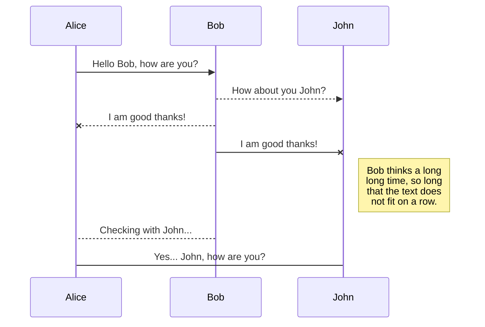
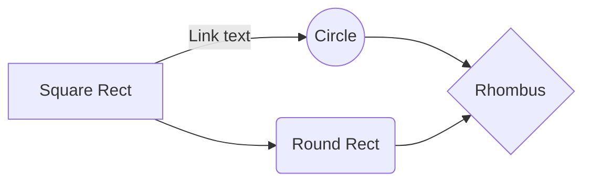

#  Galo da Velha
Este projeto foi criado como solução do projeto 1 de Linguagens de Programação 2023/2024.

Um jogo para dois jogadores feito em C# 8.0. O projeto consiste de um tabuleiro com 16 espaços (4x4), existindo 16 peças diferentes que podem ser construídas combinando as quatro características seguintes:
 - Tamanho (grande/pequeno)
 - Cor (clara/escura)
 - Forma (círculo/quadraado)
 - Furo (com/sem)
 
*Tabuleiro de jogo*
## Objetivo
O objetivo do jogo é completar uma linha com quatro peças que sejam semelhantes em pelo menos umas das suas quatro características (tamanho, cor, forma ou furo). A linha pode ser vertical, horizontal ou diagonal. O vencedor é o jogador que colocar a quarta da linha. O jogo termina em empate quando nenhum atinge o objetivoapós colocação das 16 peças.

## Regras do Jogo
Os jogadores jogam alternadamente, colocando uma peça no tabuleiro. Uma vez colocaads as peças não podem voltar a ser movidas.
A escolha da peça a colocar no tabuleiro não é feita pelo mesmo jogador que a coloca; é o adversário que decide qual será a peça seguinte a colocar:
1. Adversário escolhe peça a ser colocada pelo jogador atual.
2. Jogador atual coloca no tabuleiro a peça dada pelo adversário.

Se a peça colocada pelo jogador atual fizer uma linha de quatro peças com pelo menos uma característica semelhante (tamanho, cor, forma ou furo), esse jogador vence.

# Autoria

- André Sebastião a22008519
- António Sotto-Mayor a22007432
- Diogo Freire a22104684

## Distribuição de Tarefas
André Sebastião
 - Criação do documento README.md.
 - Implementação e integração dos diferentes elementos e fluxogramas no documento README.md.
 - Criação dos textos e repostas dadas ao jogador durante o jogo.
 - Documentação de diferentes partes do código.
 
António Sotto-Mayor
- Lógica dos fluxogramas.
- Criação das várias peças do jogo.
- Criação do tabuleiro de jogo.
- Implementação das regras
- Resolução de bugs.

Diogo Freire
- Implementação das peças coloridas.
- Menu inicial.
- Implementação das regras.
- Resolução de bugs.

## Fluxograma

## UML diagrams

You can render UML diagrams using [Mermaid](https://mermaidjs.github.io/). For example, this will produce a sequence diagram:

And this will produce a flow chart:

